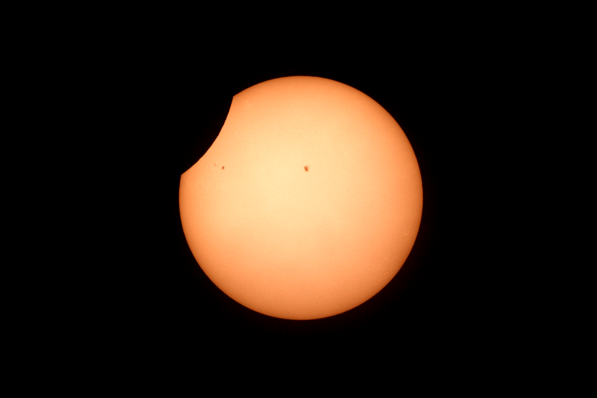
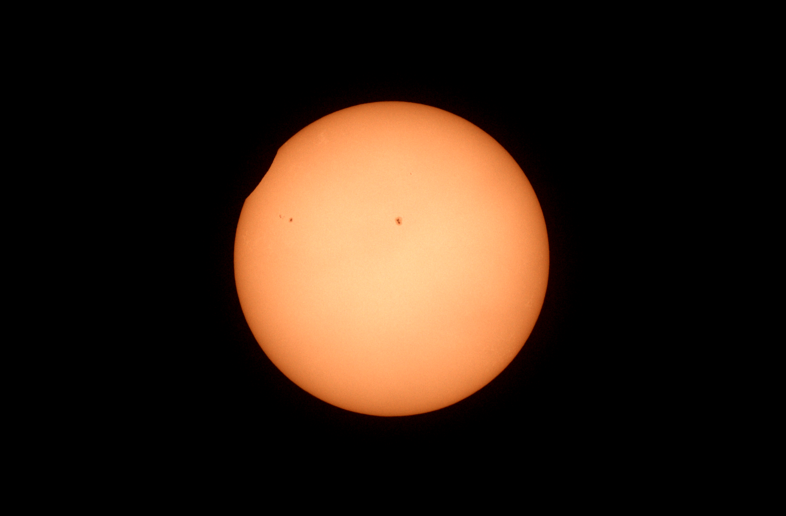

# Total Solar Eclipse

## April 8, 2024

First partial phase of the eclipse:

---

---

---

---

---

---

---

---

---

---

Totality:

---

---

---

---

---

As someone observing with us warned us that totality was about to be over...I managed to get the elusive ring!

---

And then, the second partial phase:

---

---

---

---

---

---

---

